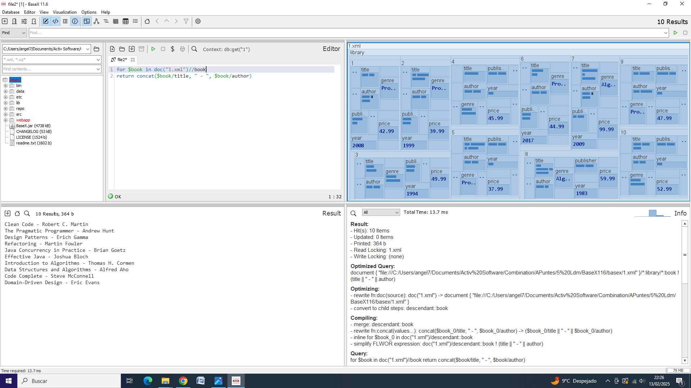
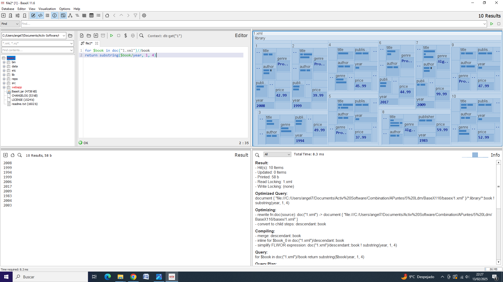
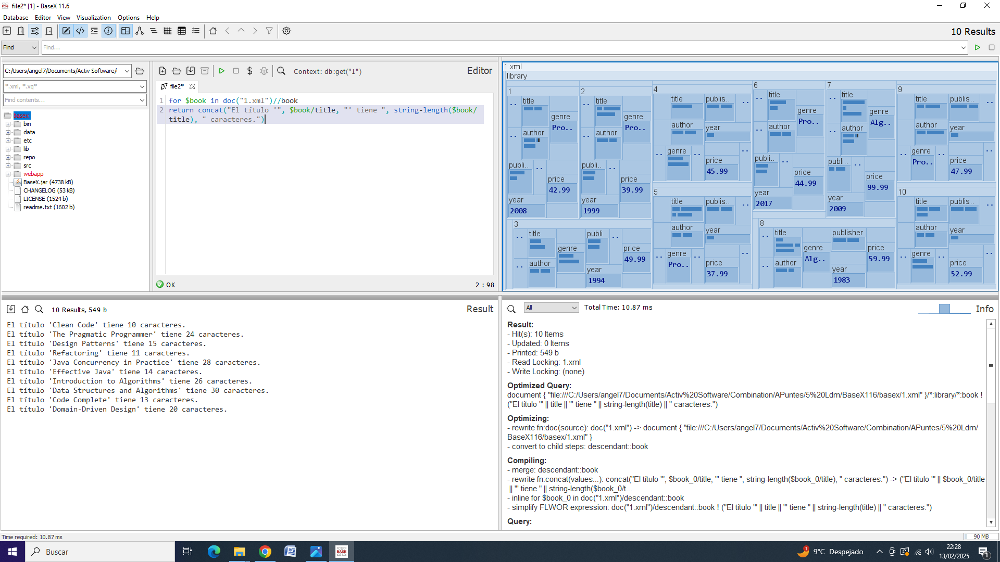

# Manipulación de Cadenas en XQuery

## Intro

En XQuery, la manipulación de cadenas es una operación muy común, que se utiliza para extraer, modificar o analizar datos dentro de documentos XML. XQuery proporciona varias funciones incorporadas que permiten trabajar con y manipular cadenas de texto. 

La manipulación de cadenas se puede realizar mediante funciones corrientes como:

- **`concat()`**: Concatenar dos o más cadenas.
- **`substring()`**: Extraer una subcadena de una cadena dada.
- **`string-length()`**: Obtener la longitud de una cadena.
- **`normalize-space()`**: Eliminar los espacios en blanco extra al principio y al final de una cadena.
- **`upper-case()` y `lower-case()`**: Convertir una cadena a mayúsculas o minúsculas.
- **`encode-for-uri()`**: Codificar una cadena para su uso en una URL.

A continuación, se muestran ejemplos prácticos de cómo usar estas funciones en XQuery.

## Explicación Teórica

1. **Concatenación de Cadenas**  
   Usamos la función `concat()` para unir dos o más cadenas. La función toma uno o más argumentos y los une en un solo resultado.

   **Sintaxis**:  
   ```xquery
   concat(Hola1, Y2, Adiós3, ...)

<<<<<<< HEAD
## Ejemplos
### Concat:  

### SubString: 

### StringLenght: 


<-- [Expresiones Lógicas (and, or, not())](./carlosHdz.md) ======================= [Funciones Agregadas (count(), sum(), etc.)](./gabriel.md) -->
>>>>>>> 8556592ae3b6f6d1dc7249688d68bb7226829265
