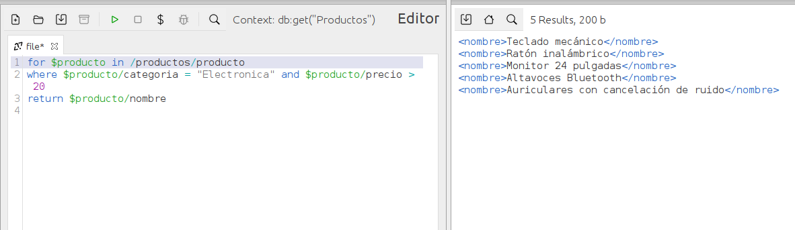
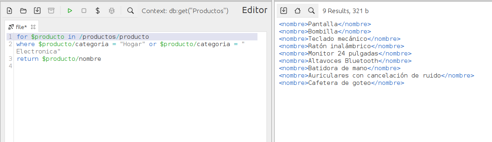
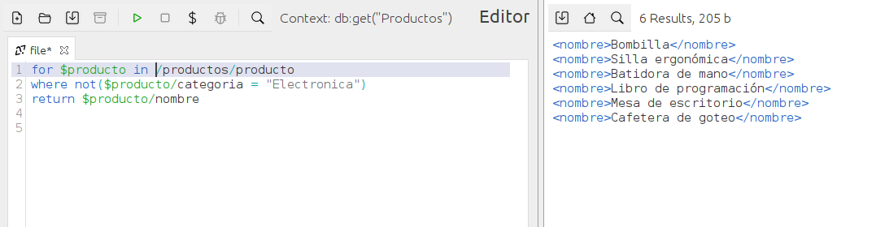

# EXPRESIONES LÓGICAS #

## OPERADORES and, or, not() ##

> Los operadores lógicos especifican la relación entre operandos en una expresión lógica. 

- El operador lógico **not()** : Se utiliza para negar variables lógicas o constantes. Indica que uno u otro de sus operandos debe ser verdadero para producir un resultado verdadero.

- El operador lógico **AND** y **OR** : Se utilizan para especificar la relación entre operandos en una expresión lógica. Este operador indica que ambos operandos tienen que ser verdaderos para producir un resultado verdadero.

> Se pueden sustituir estos valores por los símbolos **&**,en el caso del AND, **|** en el caso del OR y **!** en el caso del NOT().

> El resultado de una expresión lógica es un valor booleano o un error. Cuando se evalúa una expresión lógica, se determina el valor booleano efectivo (EBV) de cada operando. A continuación, el operador se aplica a los EBV de  los operandos y el resultado vuelve a ser un valor booleano o un error.

## Tabla de Operandos ##
Si el EBV de un operando es un error, la expresión lógica puede dar como resultado un error. La siguiente tabla nos muestra los resultados devueltos por una expresión lógica basada en los EBV de sus operandos.

| EBV de Operando 1 | Operador | EBV de Operando 2 | Resultado |
|-------------------|----------|-------------------|-----------|
| true | **&** | true | true |
| true | **&** | false | false |
| false | **&** | true | false |
| false | **&** | false | false |
| true | **&** | error | error |
| error | **&** | true | error |
| false| **&** | error | false o error |
| error | **&** |false | false o error |
| error | **&** | error | error |
| true | **|** | true | true |
| false | **|** | false | false |
| true | **|** | false | true |
| false | **|** | true | true |
| true | **|** | error | error o true |
| error | **|** | true | error o true |
| false | **|** | error | error |
| error | **|** | false | error |
| error | **|** | error | error |

## Ejemplos de Uso en BaseX

### Ejemplo de filtrado en productos.xml que sean de la categoría "Electrónica" y cuyo precio sea mayor a 20. ###

### Ejemplo de filtrado en productos.xml que sean de la categoría "Hogar" o "Electrónica". ###

### Ejemplo de filtrado en productos.xml que no sean de la categoría "Electrónica". ###

<-- [Comparadores](./PCB.md) ======================= [Manipulación de Cadenas](./AGP.MD) -->