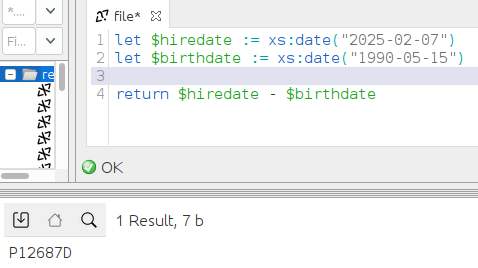
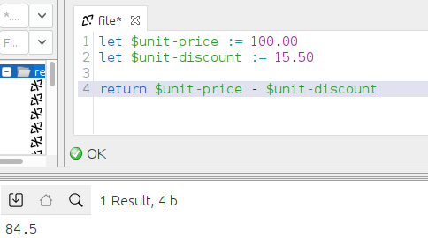

# Lenguaje de marcas - UT7 - T1
## Realizada por: Illia Shubin
## El tema: Expesiones Aritmeticas
- Por forma totalmente aleatoria mi parte del trabajo consiste en:
    1. Explicacion teorica sobre el grupo de expreciones XQuery
    2. Ejemplo practico con codigo XQuery
    3. Captura de pantalla de la ejecucio9n del codigo en BaseX

---

## Explicacion teorica
Las expresiones aritmeticas realizan operaciones que implican suma, resta, multiplicacion, division y modulo

Siguiente tabla describe los operadores aritmeticos y los lista por orden de prioridad de operador, de mas alta a mas baja. En XPath los operadores unarios (primera fila) tienen una prioridad mayor que los operadores binarios

  | Operador | Finalidad | Asociatividad |
|--------------|--------------|--------------|
| -(unary), +(unary)| niega el valor del operando, matiene el valor del operadp| derecha a izquierda|
| *, div, idiv, mod| multiplicacion, divicion, divicion entera, modulo| izquierda a derecha|
|+, - | adicion, resta |izquierda a derecha | 

---

## Ejemplo practico
* En este ejemplo la primera expresion devuelve el valor decimal *-1.5*, la segunda expresion devuelve el valor integer *-1* 
`-3 div 2`
`-3 idiv 2` 
* En la siguiente expresión, la resta de dos valores de fecha da como resultado un valor de tipo xdt:dayTimeDuration:
`$emp/hiredate - $emp/birthdate`
* El ejemplo siguiente ilustra la diferencia entre un operador de resta y guiones que se utilizan en los nombres de variable unit-price y unit-discount
`$unit-price - $unit-discount`

---

## Capturas de pantalla
### Primera captura

### Segunda captura

### Tercera captura

### Cuarta captura

